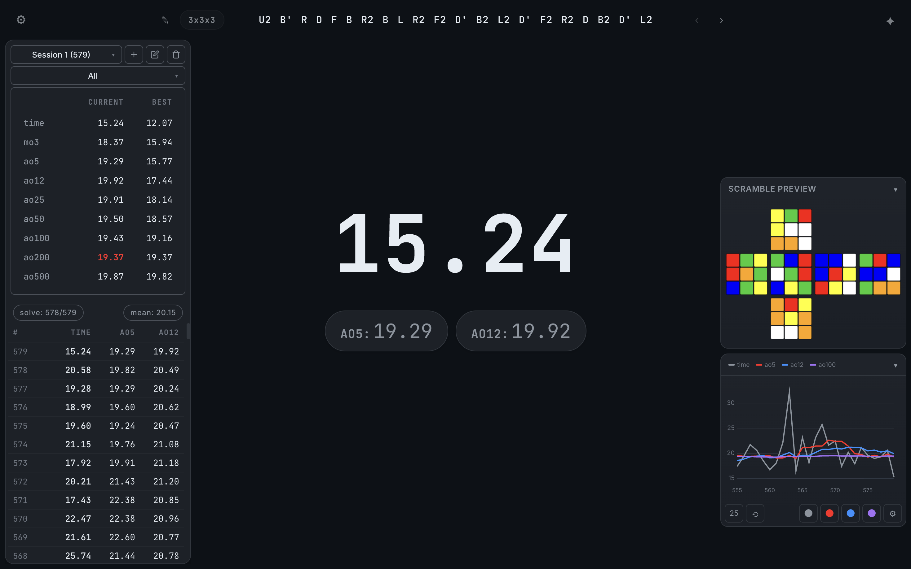
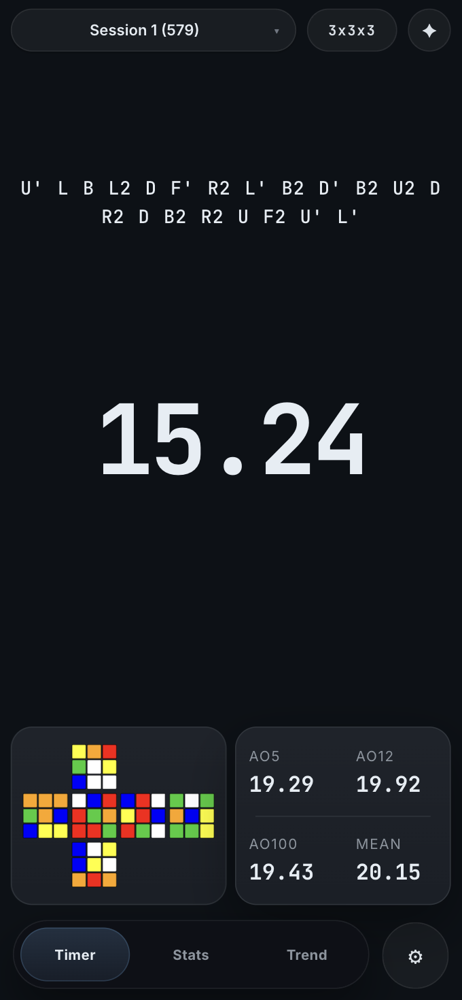
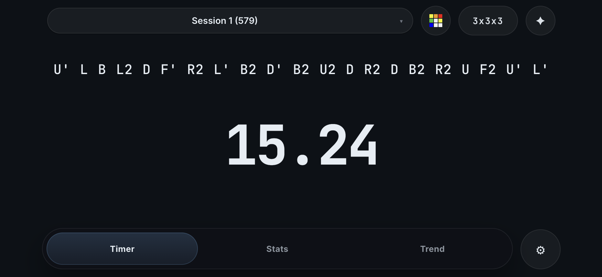

# https://zukrainak47.github.io/timer/
<!-- ### This calculator will tell you how many more wishes you will need to guarantee any combination of 5-star characters and weapons based on your pity, primogems etc.
### You will also be presented a graph showing the probabilities for lower amounts of additional wishes, the odds are calculated based on all possible 50/50 wins/losses combinations. (Capturing radiance makes this 55/45 for the character banner, assumed for simplicity)
### There's also support for a 2nd account for those who need that. You can enable it as well as tweak some other parameters in the settings!
### Everything is backed up in your browser locally as well, so you won't have to input all of your data every time.
I hope this is helpful to some. Good luck on your pulls! :) -->

I like clean UI so decided to remake [csTimer](https://cstimer.net/) in a more modern way, feedback appreciated! Mobile version inspired by [CubeTime](https://cubetime.app/).

## Desktop version
### Supports lots of nice keyboard shortcuts, `Ctrl` + `/` to view them inside the timer

## Mobile version
### Swipe down for quick actions

<!-- While idle:
- `=`/`+` = toggle +2
- `-` = toggle DNF
- `Backspace`/`Delete` = delete solve
- `Shift` + `1/2/3...` = view average summary
- `Arrow keys` = pan graph
- `Shift` + `Arrow keys` = zoom graph
- `Enter` = reset graph
- `Shift` + `Enter` = show last 25 solves
- `/` = settings
- `Z` = toggle zen mode
- `D` = toggle delta
- `T` = collapse/expand time trend
- `S` = collapse/expand scramble preview
- `C` = copy scramble
- `.` = next scramble
- `,` = previous scramble
- `Tab` = add comment

While solving:
- `Esc`/`Backspace`/`Delete` = mark solve as DNF -->
